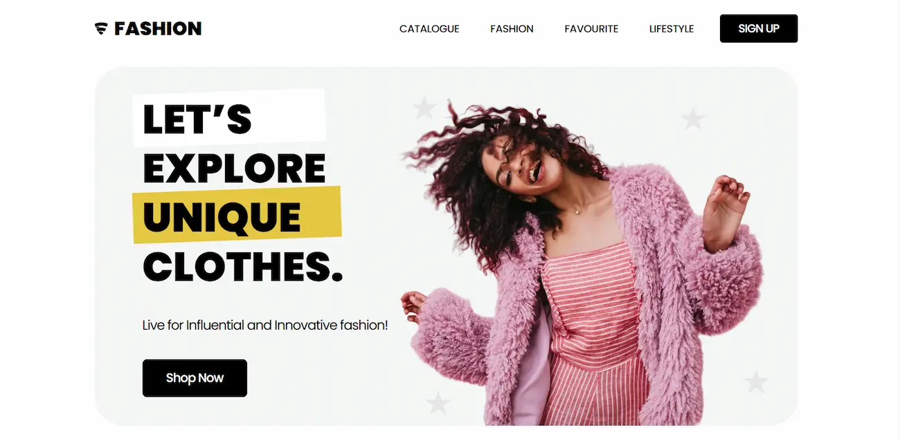

# Fashiong Shopping Landing Page

In this project I use Tailwind CSS to build this landing page inspired by a design taken from figma. 

[Live preview](https://fashion-shopping-landing.pages.dev/)

## Features
- Fully responsive
- Smart sticky navbar
- Dropdown menu
- Automatic slider

## Original Design
[layout](original_layout.webp)

## Acknowledgement
Thanks to [Nickelfox Design](https://www.figma.com/@erme07) for the [design](https://www.figma.com/community/file/1135871952737326157/shopping-website)
